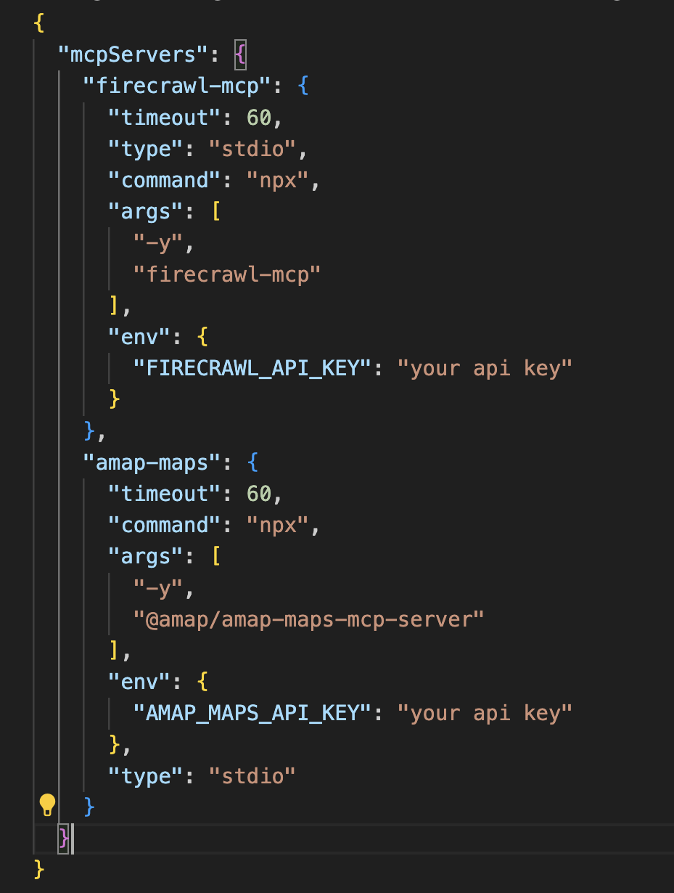

# Introduction to MCP
This tutorial walks you through configuring MCP servers in VS Code using the [Cline](https://docs.cline.bot/getting-started/installing-cline) extension.
You’ll learn how to install the tools, set up Node.js, and configure servers like Firecrawl and Baidu Map.
Most importantly, you will see the mechanism behind all the processes!

## What you will learn
- What the MCP client is and how it connects LLMs with MCP servers with Cline
- How to install and set up the environment
- How to configure MCP servers with API keys
- Mechanism of MCP with a real use case

## Prerequisites
- VS Code installed
- API keys for the MCP servers you want to use.

## Let's go!
Before we start, I would like to present the three key components:
  1. **LLM**: The “brain” of the system. It understands your natural language request and decides when to call a tool to get real data.
  3. **MCP Client**: This is the “connector” or port. Its job is to let the LLM talk to MCP servers and to forward requests/responses between them.
  4. **MCP Server**: The tools that really do the job, such as web crawling. It describes to the client what functions it provides, waits for the LLM’s request, and then sends back results.

### Step 1: Cline Installation 
The first step is to install an MCP client. Cline is one of the easiest MCP clients to use as it is integrated into VS Code. You can just search and download Cline in the extensions marketplace of VS Code:

### Step 2: Choose your favourite LLM
The second step is to configure your LLM. You can choose your preferred LLM from multiple sources (OpenAI, Gemini, Claude, etc.) 
The fastest way is to get an [OpenRouter](https://openrouter.ai/) API key as they provide free LLMs from families as Deepseek, Qwen, and Mistral, etc. 

### Step 3: Set up your CMCP server.
First of all, you need to download [Node.js].(http://Node.js) Many MCP servers require Node.js to run because most of them are written in JavaScript/TypeScript, and Node.js provides the runtime environment needed to execute these programs.

Then, create a configuration file in the root directory to register our MCP servers. This file instructs the MCP client (Cline) on which servers to load, how to start them, and what credentials are required. ** Don't worry, you can find how to fill it in the official document of each MCP server, and you need to get an api key for each of them.**

In our case, we configured two popular MCP servers: Firecrawl for web crawling, and Gaode Map for location search and transport planning. 

Once you fill this JSON file, you can check in Cline if they are correctly configured:

Now the configuration is done, we can start a chat in Cline to try it out! 

### Real use case 

