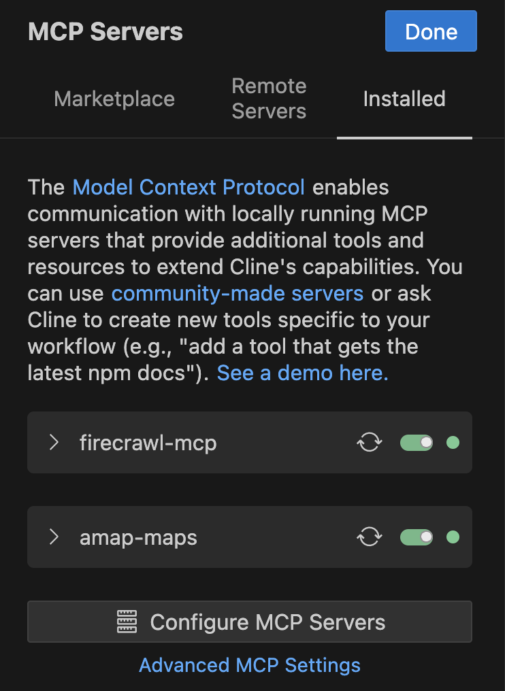

# Trip Planner MCP 
## Introduction to MCP
This tutorial walks you through configuring MCP servers in VS Code using the [Cline](https://docs.cline.bot/getting-started/installing-cline) extension.
You’ll learn how to install the tools, set up Node.js, and configure servers like Firecrawl and Gaode Map.
Most importantly, you will see the mechanism behind all the processes!

## What you will learn
- What the MCP client is and how it connects LLMs with MCP servers with Cline
- How to install and set up the environment
- How to configure MCP servers with API keys
- Mechanism of MCP with a real use case

## Prerequisites
- VS Code installed
- API keys for the MCP servers you want to use.

## Let's go!
Before we start, I would like to present the three key components:
  1. **LLM**: The “brain” of the system. It understands your natural language request and decides when to call a tool to get real data.
  3. **MCP Client**: This is the “connector” or port. Its job is to let the LLM talk to MCP servers and to forward requests/responses between them.
  4. **MCP Server**: The tools that really do the job, such as web crawling. It describes to the client what functions it provides, waits for the LLM’s request, and then sends back results.

### Step 1: Cline Installation 
The first step is to install an MCP client. Cline is one of the easiest MCP clients to use as it is integrated into VS Code. You can just search and download Cline in the extensions marketplace of VS Code:


### Step 2: Choose your favourite LLM
The second step is to configure your LLM. You can choose your preferred LLM from multiple sources (OpenAI, Gemini, Claude, etc.) 
The fastest way is to get an [OpenRouter](https://openrouter.ai/) API key as they provide free LLMs from families as Deepseek, Qwen, and Mistral, etc. 


### Step 3: Set up your CMCP server.
First of all, you need to download [Node.js].(http://Node.js) Many MCP servers require Node.js to run because most of them are written in JavaScript/TypeScript, and Node.js provides the runtime environment needed to execute these programs.

Then, create a configuration file in the root directory to register our MCP servers. This file instructs the MCP client (Cline) on which servers to load, how to start them, and what credentials are required. ** Don't worry, you can find how to fill it in the official document of each MCP server, and you need to get an api key for each of them.**

In our case, we configured two popular MCP servers: Firecrawl for web crawling, and Gaode Map for location search and transport planning. 

```json
{
  "mcpServers": {
    "firecrawl-mcp": {
      "timeout": 60,
      "type": "stdio",
      "command": "npx",
      "args": [
        "-y",
        "firecrawl-mcp"
      ],
      "env": {
        "FIRECRAWL_API_KEY": "your api key"
      }
    },
    "amap-maps": {
      "timeout": 60,
      "command": "npx",
      "args": [
        "-y",
        "@amap/amap-maps-mcp-server"
      ],
      "env": {
        "AMAP_MAPS_API_KEY": "your api key"
      },
      "type": "stdio"
    }
  }
}
```

Once you fill this JSON file, you can check in Cline if they are correctly configured:



Now the configuration is done, we can start a chat in Cline to try it out! 

## Real Use Case: Planning a One-Day Trip in Haikou City

In this example, we will combine two MCP servers to plan a one-day trip in my hometown, Haikou City, in the lovely tropical island of China. 

Remember we have two MCP servers: 

- **Firecrawl**  
  - Takes a web URL as input and returns website content.  
  - Its coolest feature is that you can define a **JSON schema**, and it will intelligently extract structured information from the web page according to that schema.  
  - This saves a lot of time compared to manually processing raw text.

- **Gaode Map (amap-maps)**  
  A map MCP powered by one of the most popular map applications in China.  
  It provides tools such as:
  - Converting place names into geographic coordinates  
  - Weather search  
  - Route planning (driving, walking, bicycling, public transit)  
  - Distance calculation

### Use Case Description

Our scenario is as follows:

1. Extract **3 attractions** from a travel blog, including their **name, location, and description**.  
2. Send these places to the **Map MCP** to generate a **public transportation route**.  
3. Combine the extracted information and the route plan into a **one-day travel itinerary** with all details:
   - Which places to visit  
   - What activities to do at each place  
   - How to get from one place to another using public transportation


All we need to do is to give a prompt, the LLM will select the best MCP server and its tool to do all the job for us! 

<pre> ```
Background:
I am traveling to Haikou City in China, and I am especially interested in cultural and historical attractions.

Task:
Extract 3 tourist attractions from a travel website:https://www.chinadiscovery.com/hainan/haikou/things-to-do.html 
That aligns with my interest, then use the maps MCP to generate a travel plan.

Steps:
1. Use the web crawling MCP firecrawl_extract to get attractions from the website in JSON format. 
   Output JSON schema: 
   - Places to Visit: name of the place 
   - location: Chinese address or landmark, required in Chinese for map accuracy
   - Description: a description of the place and things to do in English
   - Recommend Length of Visiting: time for visit 

Note: Prefer cultural and historical attractions if possible. Then you select only three of them that aligns most to my interest. 

2. Use maps_geo to convert each location into coordinates.

3. Plan the trip: start from the first attraction, then go to the second, then the third. 
   Use maps_direction_transit_integrated to get routes with public transportation routes. I have no car. 

4. Generate a final travel plan in Markdown text:
   - Attraction name + things_to_do
   - Route details between attractions with public transportation
   - Full, readable itinerary with cultural highlights
  - You should organize my day with a plan to make sure I have a good time in Hiakou City
``` </pre>

### Model Response
The LLM first analyzes the human request and looks through the available tools from each MCP server. It selects the firecrawl_extract tool from the Firecrawl MCP server, since its description best matches the user’s needs.


This is because, as shown here, in the toolbox of each MCP server, each tool has a description of what it is capable of and what kind of parameters it needs to perform the job. The LLM analyzes the human request first and looks through all the available tools to select the one whose description aligns the most with the request. 

It then generates a JSON request for Firecrawl, filling in all required parameters:

```json
{
  "urls": ["https://www.chinadiscovery.com/hainan/haikou/things-to-do.html"],
  "prompt": "Extract tourist attractions focusing on cultural and historical places in Haikou city. Provide the following JSON schema: Places to Visit (name), location (Chinese address or landmark, required in Chinese), Description (English description of the place and things to do), Recommend Length of Visiting (time for visit).",
  "schema": {
    "type": "object",
    "properties": {
      "Places to Visit": { "type": "string" },
      "location": { "type": "string" },
      "Description": { "type": "string" },
      "Recommend Length of Visiting": { "type": "string" }
    },
    "required": ["Places to Visit", "location", "Description", "Recommend Length of Visiting"]
  },
  "allowExternalLinks": false,
  "enableWebSearch": false,
  "includeSubdomains": false
}
```
This illustrates the essence of MCP: translating a human request into a JSON request that can be executed by any MCP server.

The JSON request is sent to Firecrawl, which returns the main tourist attractions in Haikou, each structured according to the defined schema.
I really like this extract scraping than simple crawling, as you can see, it not only crawls web information but also extracts what you want and returns it in a structured format! 

```json
One of the attractions:
{
    "name": "Qilou Old Street",
    "location": "海口市龙华区得胜沙路到长堤路",
    "coordinates": "110.347230,20.045266",
    "Description": "Qilou Old Street, with a total length of 4.4 kilometers and over 600 arcade buildings, showcases the most distinctive street landscape of Haikou City. The buildings were mostly constructed by overseas Chinese returning from abroad in the early 20th century, featuring elegant sculptures and foreign decorations. Sipailou, the oldest building, dates back to the Southern Song Dynasty. The street is also home to Haikou Qilou Snack Street, which offers a variety of local delicacies like Wenchang Chicken and Hainan noodles.",
    "Recommend Length of Visiting": "1~2 hours"
  }
```

Next, the LLM decides to call the Amap MCP server to obtain geographic coordinates of the attractions using the maps_geo tool. Once the locations are retrieved, it plans the public transit route with maps_direction_transit_integrated, which provides detailed instructions including bus numbers, stops, and total duration.


Example of the returned route plan:

```json
"segments": [
          {
            "walking": {
              "origin": "110.347229,20.045259",
              "destination": "110.344765,20.044636",
              "distance": "275",
              "duration": "235",
              "steps": [
                {
                  "instruction": "Walk 145 meters diagonally to the left.",
                  "road": [],
                  "distance": "145",
                  "action": "Walk diagonally to the left.",
                  "assistant_action": []
                }
                ......
            "bus": {
                "buslines": [
                  {
                    "name": "Route G37 (Train Station → Yucheng Village Bus Terminal)",
                    "departure_stop": {
                      "name": "水巷口"
                    },
                    "arrival_stop": {
                      "name": "省林业厅"
                    },
                    "distance": "4694",
                    "duration": "1738",
                    "via_stops": [
                      {
                        "name": "和平桥"
                      },
                 .......
```
This process is repeated until all destinations are connected by an integrated public transit solution.
In the end, the LLM gathered all the information from the iterations and crafted a one-day trip plan in my city:
```markdown
# Haikou City Cultural and Historical Attractions Travel Plan

## 1. Qilou Old Street

- Description: Qilou Old Street, with a total length of 4.4 kilometers and over 600 arcade buildings, showcases the most distinctive street landscape of Haikou City. The buildings were mostly constructed by overseas Chinese returning from abroad in the early 20th century, featuring elegant sculptures and foreign decorations. Sipailou, the oldest building, dates back to the Southern Song Dynasty. The street is also home to Haikou Qilou Snack Street, offering local delicacies like Wenchang Chicken and Hainan noodles.
- Recommended Visit Length: 1 to 2 hours

## Route from Qilou Old Street to Wugong Temple

- Walk about 275 meters along 博爱北路 (Bo'ai North Road) to 水巷口 (Shuixiangkou) bus stop.
- Take bus G37路 from 水巷口 to 省林业厅 (Provincial Forestry Department) stop (approx. 29 minutes).
- Walk about 92 meters along 海府路 (Haifu Road) to Wugong Temple.
- Total travel time: Approx. 34 minutes.

## 2. Wugong Temple (Five Official Temple)

- Description: Wugong Temple, also known as 'Hainan First Floor,' is a wooden complex built in memory of five officials deported to Haikou during the Tang and Song dynasties. It provides insights into ancient Chinese relegation rules and the history of Hainan Province. Nearby, Hairui Tomb honors Hai Rui, a respected official of the Ming Dynasty, featuring solemn architecture and stone carvings along the path to the grave.
- Recommended Visit Length: 1 to 2 hours

## Route from Wugong Temple to Hainan Museum

- Walk about 136 meters along 海府路 to 省林业厅 (Provincial Forestry Department) bus stop.
- Take bus G51路 from 省林业厅 to 省图书馆 (Provincial Library) stop (approx. 19 minutes).
- Walk about 650 meters along 国兴大道辅路 (Guoxing Avenue Auxiliary Road) to Hainan Museum.
- Total travel time: Approx. 32 minutes.

## 3. Hainan Museum

- Description: Hainan Museum is a comprehensive museum showcasing the history and culture of Hainan. It features exhibitions on maritime civilization, Hainan history, and customs, along with displays of cultural relics. The museum is recognized as one of the six most beautiful buildings in Hainan and offers a deep dive into the region's heritage.
- Recommended Visit Length: 2 hours

This itinerary ensures you experience the rich cultural and historical heritage of Haikou city with efficient public transportation routes and ample time at each attraction for a fulfilling visit.
```
As a local, I have to say, it's a decent plan to explore Haikou City!

## Conclusion: How MCP Works Behind the Scenes?

After walking through the Haikou trip planning example, we can clearly see how MCP ties everything together. Let’s revisit the key questions:
### 1. What exactly is MCP?
MCP (Model Context Protocol) is the bridge between the LLM and external tools.
- The LLM is the “brain” that understands your request.

- The MCP Client (like Cline) is the port/connector that forwards requests and responses.

- The MCP Servers are the tools (Firecrawl, Gaode Map, etc.) that actually execute the job and return results.

In our example, Firecrawl served as the web crawler and extractor, while Gaode Map handled geo-coordinates and route planning.

### 2. How does the LLM know which MCP server and tool to use?
Each MCP server describes its tools in a toolbox-like manifest, including the tool’s capabilities (what it can do) and the parameters it requires.
When you give a natural language task — e.g., “find cultural attractions in Haikou and plan a public transit route” — the LLM parses the request, checks the tool descriptions, and matches the task to the right tool.

- To extract structured attraction data → it chose firecrawl_extract.
- To get coordinates → it chose maps_geo.
- To plan the transit route → it chose maps_direction_transit_integrated.

The LLM doesn’t hardcode which tool to call — it dynamically decides based on the toolbox definitions.

### 3. How does the LLM issue a command, and how does the server understand it?
Once the LLM selects the tool, it generates a JSON request that matches the schema expected by that tool.
- Example: a JSON request to Firecrawl specifying the url, prompt, and the schema of data we want.
- This JSON is sent through the MCP client to the MCP server.

The server simply waits for incoming JSON that matches its declared format, executes the task (e.g., crawl a webpage, search a map, plan a bus route), and returns results — again in structured JSON.

The LLM then reads the results, reasons about them, and continues with the next step until the whole task is complete.

###The Big Picture
So in short:

- MCP is the protocol that standardizes how LLMs talk to external tools.

- The LLM acts as the planner, deciding what needs to be done.

- The client is the connector, routing requests/responses.

- The servers are the executors, doing the actual work and returning structured outputs.

That’s why, with only one natural language request, the LLM was able to extract cultural attractions, find coordinates, plan routes, and finally assemble a one-day Haikou itinerary — all by orchestrating multiple MCP servers seamlessly.


